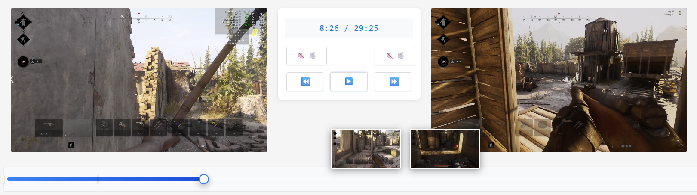
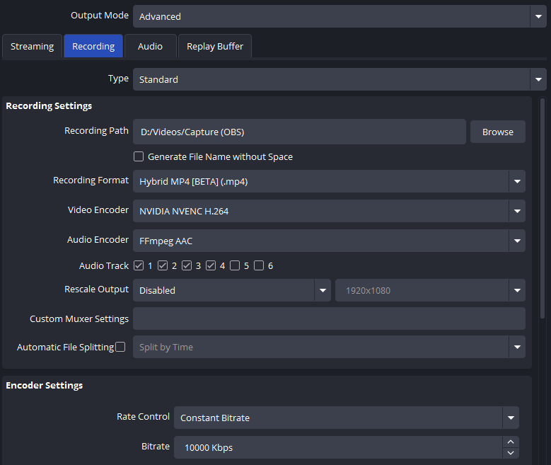
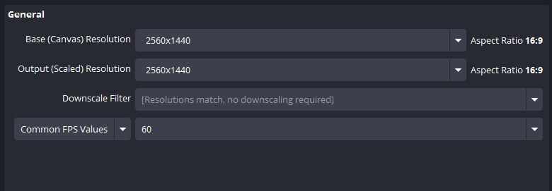
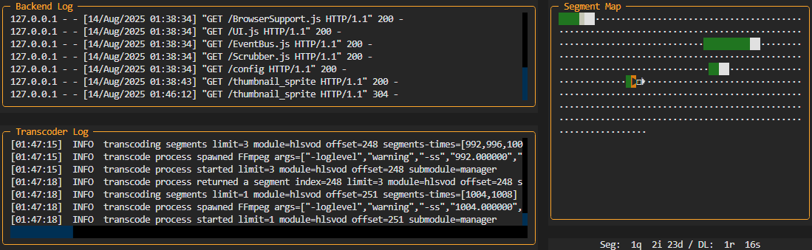

# CrossStream

Synchronized side-by-side video player for instant collaborative review of concurrent screen recordings



## ✨ Features

- **Side-by-side playback**: Review your screen recording side-by-side with your teammate's
- **Real-time Synchronization**: Synchronized player positions -- review the two recordings in parallel on your local machine, while your teammate is doing the same on theirs
- **Instant Connection, just-in-time transcoding**: Your recordings are transcoded and streamed to the other party just-in-time, while you both review -- no need to screen share your video player, or transmit/exchange any video files, or wait for YouTube or Twitch to finish rendering

## 🚀 Getting Started

### Prerequisites

- Nvidia GPU
- Python 3.12 or later
- uv (Python package manager)
- FFmpeg with FFprobe (must be in system PATH or in the `tools/` directory)
- Modern web browser with WebRTC support (Chrome, Firefox, Edge, or Safari) and h.264 decoder support (e.g. *not* Chromium)
- A fellow teammate who you want to review your games with -- must be willing to go through the technical hurdles of setting this up.

### Recording Configuration

Nvidia GeForce Experience recording should theoretically work, but hasn't seen much testing recently.
AMD and Intel GPUs are currently not supported by the encoder configuration, but should be possible to add in the future.

So for now, [OBS](https://obsproject.com/) is the recommended recording solution.

Here's the recommended configuration:

Under `Settings > Output > Recording`, set up your desired video quality.
We recommend using the `Hybrid MP4 (BETA)` format, because then you can set chapter marks while recording, which will be picked up by CrossStream.



Under `Settings > Output > Audio`, define your audio setup.

For now, only the first audio track will be picked up, so you may either set this to your gameplay audio only, if you just want to discuss tactical situations, or you may merge it with all your voice comm tracks, if you also want to discuss communication.


Under `Settings > Video`, you should set a 16:9 resolution for now. 



### Recording gameplay

Now start a recording on both machines. You don't need to start precisely at the same time, as the videos will get synchronized automatically. You just need to record the same game.

Finish your round and stop the recording on both machines.

### Playback and review

1. **Forward the ports**:

You'll need to forward two TCP ports from your router to your computer:

By default, these are:

- Port 6001 for the backend (fetching the configuration from the other machine, downloading its thumbnails and serving the frontend)
- Port 6002 for the transcoder (fetching the video stream)

2. **Run the app**:

Until a full config file solution is implemented, you might want to use a script like this:

```cmd
:: Set environment variables
SET "MY_PUBLIC_HOSTNAME=me.mydyndns.org"
SET "MY_BACKEND_PORT=6001"
SET "MY_TRANSCODER_PORT=6002"
SET "MY_VIDEO_PATH=D:\Videos\Capture (OBS)"

:: Run the backend.host module with UV
uv run -m backend.host --host=%MY_PUBLIC_HOSTNAME% --port=%MY_BACKEND_PORT% --transcoder-port=%MY_TRANSCODER_PORT% --media-dir="%MY_VIDEO_PATH%"
```

Save this in the root CrossStream source directory and run it.

It will automatically pick up the latest video file in the directory. The two videos will automatically be synced based on the time they started recording.  



The backend TUI will launch and display:

- The log output (current activity) of the backend
- The log output (current activity) of the transcoder
- A segment map that reflects transcoder progress

Press Ctrl-Q to quit the backend.

3. **Open the frontend**:

Open http://localhost:6001/ in your browser. As soon as your teammate does the same, your two browsers will be connected and you can start reviewing your game. Hover over the scrubber to see a preview and quickly find crucial moments. Use the speaker
buttons to activate one of the audio tracks.

## 📝 Bonus features

### Chapter marks

CrossStream will automatically pick up chapter marks from your video file and display them on the scrubber.

One possibility to create these is using a Stream Deck with the `OBS Studio > Chapter Marker` action.

## 🙏 Acknowledgements

CrossStream wouldn't be possible without [m1k1o/go-transcode](https://github.com/m1k1o/go-transcode/), via our own [custom fork](https://github.com/hheimbuerger/go-transcode/commits/main-crossstream-fork/).

The vast majority of the code has been written by o3 and Claude 4.

## 📄 License

This project is licensed under the MIT License - see the [LICENSE](LICENSE) file for details.
